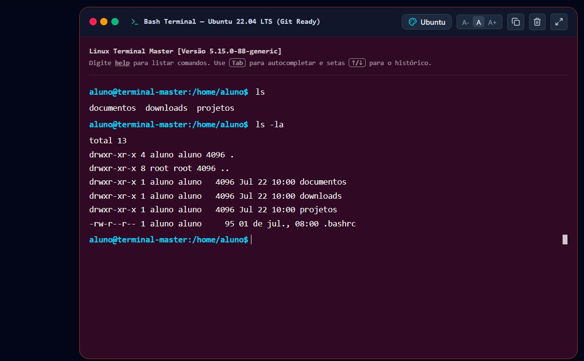
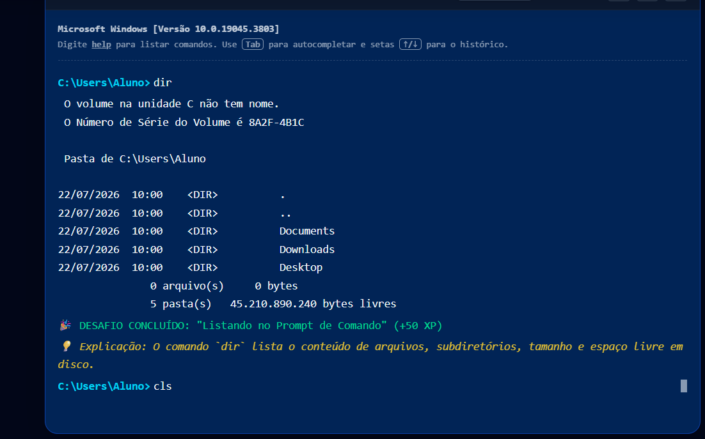
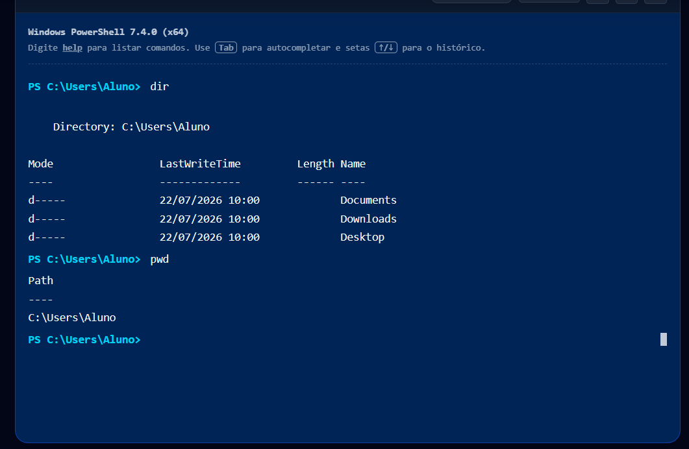
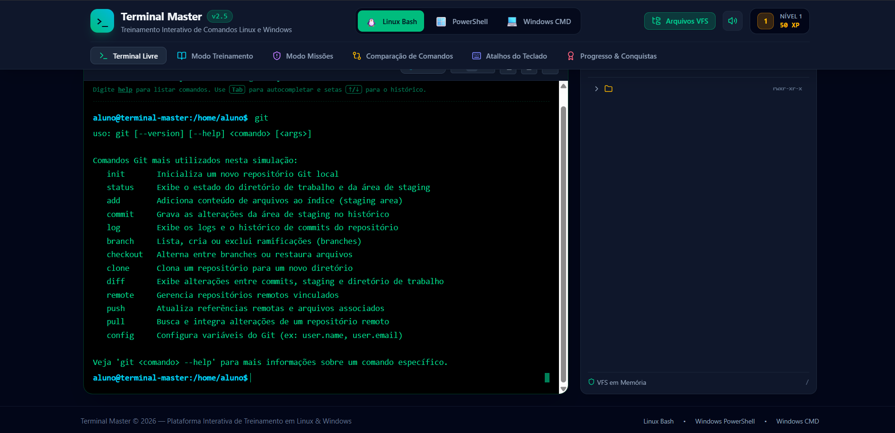

# Terminal Lab 🖥️

Projeto criado para treinar comandos de terminal Linux, Windows CMD, PowerShell e Git.

## Objetivo

Praticar comandos importantes de sistemas operacionais através de um ambiente interativo de treinamento.

## Ambientes disponíveis

- Linux Terminal
- Windows CMD
- Windows PowerShell
-

## 📸 Capturas de tela

### Terminal Linux



### Windows CMD



### PowerShell



### Git



## Tecnologias

- React
- TypeScript
- Vite

## Executar o projeto

Instale as dependências:

```bash
npm install
```

Execute:

```bash
npm run dev
```

Projeto desenvolvido para estudos e prática de comandos.
